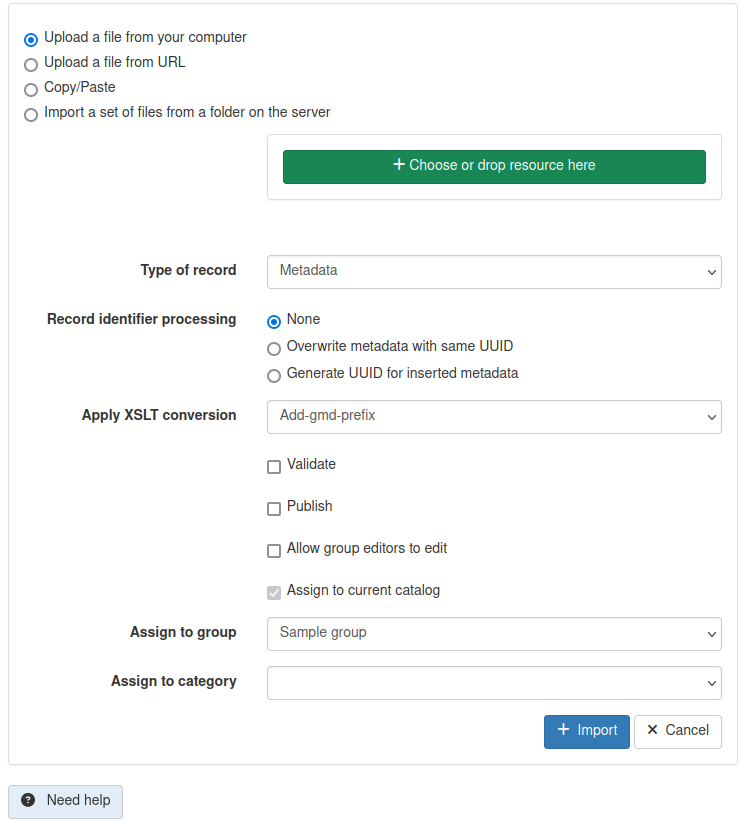

# Converter

The converter works by copying the xsl into the following folders:

* /var/lib/jetty/webapps/geonetwork/xsl/conversion/import
* /var/lib/jetty/webapps/geonetwork/WEB-INF/data/config/schema_plugins/<the_schema>/convert

Once you copy there it will be appeared in the following screen, "Apply XSLT conversion" section

